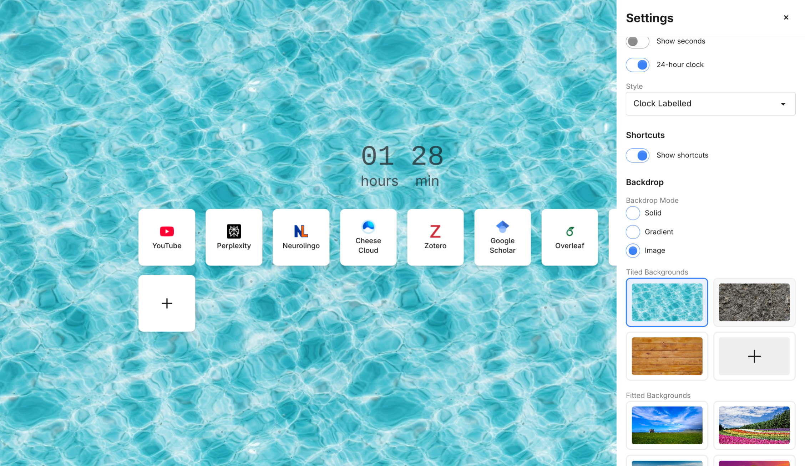

# StartBoard

A customizable, privacy-respecting start page that works everywhere — as a Chrome extension, a standalone website, or a home screen app on your phone.



## Why StartBoard?

Most default browsers and launchers track your searches and browsing habits. StartBoard gives you a beautiful, functional start page without the surveillance:

- **No tracking** — Your data stays on your device
- **No accounts required** — Works offline, no sign-up needed
- **Your choice of search engine** — Including privacy-focused options like DuckDuckGo and Brave

### Replace Google on Your Phone

Install StartBoard as a Progressive Web App (PWA) on your Android or iOS device and use it as your home screen launcher. Unlike the Google app or default browser widgets, StartBoard respects your privacy while giving you quick access to search and your favorite sites.

## Installation

### Website (Any Device)

Visit **[yiannis128.github.io/startboard](https://yiannis128.github.io/startboard)** and use it directly in your browser.

**Install as PWA on mobile:**
1. Open the website in Chrome (Android) or Safari (iOS)
2. Tap "Add to Home Screen" from the browser menu
3. Launch StartBoard like any other app

### Chrome Extension

Replace your new tab page with StartBoard:

1. Download the latest release from [Releases](https://github.com/yiannis128/startboard/releases)
2. Unzip the extension
3. Go to `chrome://extensions/` and enable "Developer mode"
4. Click "Load unpacked" and select the unzipped folder

## Features

### Search

- **Multiple search engines** — Google, DuckDuckGo, Bing, Brave Search, or set your own custom search URL
- **Bang shortcuts** — Type `!gh react` to search GitHub, `!yt music` for YouTube, and hundreds more (powered by [Helium Bangs](https://services.helium.imput.net/bangs.json))
- **Keyboard-first** — Just start typing and hit Enter

### Shortcuts

- **Quick-access bookmarks** — Add up to 16 of your favorite sites
- **Drag and drop** — Reorder shortcuts however you like
- **Automatic favicons** — Icons fetched automatically for a clean look
- **Easy management** — Right-click to edit or delete

### Customization

#### Themes
- **Light, Dark, or System mode** — Follows your OS preference automatically
- **Custom color schemes** — Choose primary, secondary, and accent colors from 8 options each

#### Backgrounds
- **Solid colors** — 8 muted tones with light/dark variants
- **Gradients** — 8 aesthetic gradients with adjustable angle
- **Images** — Preset scenic photos or seamless textures
- **Custom uploads** — Use your own images for a personal touch

#### Widgets
- **Welcome text** — Customizable greeting with multiple font styles
- **Clock** — Four display styles (basic, digital, labelled, boxed) with 12/24-hour format

### Settings Sync

- **Chrome extension** — Settings sync across devices via Chrome Sync
- **Import/Export** — Backup and restore your configuration as JSON

## Privacy

StartBoard is fully client-side. Your configuration is stored locally on your device (or synced via Chrome's built-in sync for the extension). No data is sent to external servers except:

- **Search queries** — Sent to your chosen search engine when you search
- **Favicon requests** — Fetched from Google's favicon service for shortcuts
- **Bang definitions** — Fetched once per week from Helium Bangs (cached locally)

## Development

```bash
# Install dependencies
npm install

# Watch mode (rebuilds CSS on changes)
npm run watch

# Build Chrome extension
npm run build:extension

# Build PWA
npm run build:pwa

# Build both
npm run build:all

# Test PWA locally
npx serve dist/pwa
```

## License

[GNU GPLv3](LICENSE)
